# VINCHANHXA DATATHON 2026 - ROUND 1

**Mục tiêu:** Phân tích dữ liệu thương mại điện tử và xây dựng mô hình dự đoán doanh thu (revenue forecasting) cho chuỗi bán lẻ thời trang.

---

## I. Mục lục

- [Tổng quan](#-tổng-quan)
- [Cài đặt và Chạy](#-cài-đặt-và-chạy)
- [Cấu trúc Thư mục](#-cấu-trúc-thư-mục)
- [Quy trình Xử lý](#-quy-trình-xử-lý)
- [Tech Stack](#-tech-stack)
- [Đóng góp](#-cách-đóng-góp)

---

## II. Tổng quan

Dự án tham gia cuộc thi **Datathon 2026 - Round 1** với bài toán:
1. **Phân tích khám phá dữ liệu (EDA):** Tìm insights về doanh thu, khách hàng, sản phẩm, và vận hành
2. **Dự báo doanh thu:** Xây dựng mô hình Machine Learning để dự đoán revenue cho tháng 1/2023


### Kết quả chính từ EDA

Xem chi tiết tại [`reports/KPdata.md`](reports/KPdata.md)

## III. Cài đặt và chạy

### 1. Yêu cầu hệ thống
- **Python:** 3.12 (xem file `.python-version`)
- **Hệ điều hành:** Windows/Linux/MacOS

### 2. Thiết lập môi trường

```bash
# Clone repository
git clone <repo-url>
cd vinchanhxa-datathon

# Tạo virtual environment
python -m venv .venv

# Kích hoạt
.venv\Scripts\activate    # Windows
source .venv/bin/activate # Linux/Mac

# Cài đặt dependencies
pip install -r requirements.txt
```

### 3. Tải dữ liêu (raw data) từ kaggle
```bash
# Windows
python scripts/download_data.py

# Linux/Mac
python3 scripts/download_data.py
```
Sau đó, dữ liệu sẽ được tải về tại thư mục `data/raw/`

### 4. Thiết lập database (DuckDB)

```bash
# Windows
python scripts/database.py

# Linux/Mac
python3 scripts/database.py
```
Database sẽ được tạo tại `data/database/datathon.duckdb`

### 5. Kiểm tra kết nối DB với jupyter notebook

Mở Jupyter Notebook và chạy file [`notebooks/01_ANALYSIS_.ipynb`](notebooks/01_ANALYSIS_.ipynb). Nếu không hiển thị lỗi nghĩa là Database đã sẵn sàng.


---

## 📁 Cấu trúc Thư mục

```
vinchanhxa-datathon/
├── data/                          # Dữ liệu (không commit lên Git)
│   ├── raw/                       # Dữ liệu thô từ Kaggle (sau khi download)
│   ├── database/                  # DuckDB database (sau khi setup)
│   └── processed/                 # Dữ liệu đã xử lý (submission, features)
│
├── database/                      # SQL Scripts cho DuckDB
│   ├── schema.sql                 # Định nghĩa 14 bảng (geography, customers, products...)
│   ├── seed.sql                   # Nạp dữ liệu từ CSV vào tables
│   └── index.sql                  # Indexes tối ưu query performance
│
├── docs/                          # Tài liệu
│   ├── Đề thi Vòng 1-v1.pdf       # Đề thi chính thức
│   ├── Đề thi Vòng 1-v2.pdf       # Đề thi (bản sao)
│   ├── plan_1.md                  # Kế hoạch huấn luyện mô hình
│   ├── catboost_info/             # Logs từ CatBoost training
│   └── test/                      # Folder nháp (không commit)
│
├── models/                        # Model đã train (không commit)
│   ├── lgbm_revenue_optimized_*.pkl
│   └── lgbm_sessions_predicted_*.pkl
│
├── notebooks/                     # Jupyter Notebooks (workflow chính)
│   ├── 00_MCQs_.ipynb             # Trả lời câu hỏi trắc nghiệm
│   ├── 01_ANALYSIS_.ipynb         # Phân tích tổng quan + kiểm tra DB
│   ├── 02_EDA_.ipynb              # Exploratory Data Analysis
│   ├── 03_METHODS_.ipynb          # Phương pháp luận
│   ├── 04_FEATURES_SELECTION_.ipynb  # Lựa chọn features
│   ├── 05_BASELINE_MODEL_.ipynb   # Mô hình baseline
│   ├── 06_FEATURES_ENGINEER_.ipynb # Feature Engineering
│   ├── 07_ML_.ipynb               # Machine Learning models
│   └── 08_TRAINING_.ipynb         # Training final models
│
├── reports/                       # Báo cáo
│   └── KPdata.md                  # Báo cáo phân tích EDA chi tiết
│
├── scripts/                       # Scripts tự động hóa
│   ├── download_data.py           # Tải dữ liệu từ Kaggle
│   └── database.py                # Setup DuckDB database
│
├── src/                           # Source code Python modules
│   ├── get_data.py                # Kết nối DB và đọc dữ liệu
│   ├── save_data.py               # Lưu dữ liệu vào data/processed/
│   ├── baseline_models.py         # Seasonal Naive & Linear Regression baselines
│   ├── models.py                  # Factory pattern cho 9 ML models
│   ├── optimization.py            # Optuna hyperparameter tuning
│   ├── save_model.py              # Lưu model trained (.pkl)
│   ├── submission.py              # Tạo file submission.csv
│   └── visualization.py           # SHAP, feature importance, residual plots
│
├── .gitignore                     # Ignore files (data, .venv, __pycache__)
├── .python-version                # Python version (3.12)
├── README.md                      # File này
└── requirements.txt               # Dependencies
```

Quy trình Xử lý

### Pipeline hoàn chỉnh

```mermaid
graph LR
    A[Kaggle Data] --> B[download_data.py]
    B --> C[data/raw/]
    C --> D[database.py]
    D --> E[DuckDB]
    E --> F[Notebooks 01-04]
    F --> G[Feature Engineering]
    G --> H[Notebooks 05-08]
    H --> I[ML Models]
    I --> J[Optuna Tuning]
    J --> K[Final Predictions]
    K --> L[submission.csv]
```



### Chi tiết các bước

#### Bước 1-4: Chuẩn bị dữ liệu
| Notebook | Mục đích | Output |
|----------|----------|--------|
| `00_MCQs_.ipynb` | Trả lời câu hỏi MCQ | Answers |
| `01_ANALYSIS_.ipynb` | Tổng quan + Test DB | Insights cơ bản |
| `02_EDA_.ipynb` | Khám phá dữ liệu | Visualizations |
| `03_METHODS_.ipynb` | Phương pháp luận | Methodology doc |

#### Bước 5-8: Xây dựng mô hình
| Notebook | Mục đích | Kỹ thuật |
|----------|----------|----------|
| `04_FEATURES_SELECTION_.ipynb` | Chọn features | Correlation, Importance |
| `05_BASELINE_MODEL_.ipynb` | Baseline models | Seasonal Naive, Linear Regression |
| `06_FEATURES_ENGINEER_.ipynb` | Feature Engineering | Lag features, Rolling stats |
| `07_ML_.ipynb` | ML models | RF, XGBoost, LightGBM, CatBoost |
| `08_TRAINING_.ipynb` | Final training + Tuning | Optuna, Cross-validation |

### Sử dụng Source Modules

#### Đọc dữ liệu từ DB
```python
from src.get_data import get_connection, get_data_processed

# Kết nối DuckDB
conn = get_connection(read_only=True)

# Query trực tiếp
df = conn.execute("SELECT * FROM sales LIMIT 100").df()

# Đọc data đã processed
df_features = get_data_processed('sales_features.csv')
```

#### Train model
```python
from src.models import run_all_models, run_single_model, run_final_forecast

# Benchmark tất cả models
result = run_all_models(
    df=df,
    feature_cols=features,
    target_col="revenue"
)

# Chạy 1 model cụ thể
val_result, model, metrics = run_single_model(
    model_name="CatBoost",
    df=df,
    feature_cols=features,
    target_col="revenue",
    params=best_params
)

# Forecast tương lai
future_df, model = run_final_forecast(
    model_name="CatBoost",
    df=df,
    feature_cols=features,
    target_col="revenue",
    forecast_start="2023-01-01"
)
```

#### Hyperparameter Tuning
```python
from src.optimization import tune_optuna_walkforward

best_params = tune_optuna_walkforward(
    model_name="CatBoost",
    df=df,
    target="revenue",
    features=features,
    n_trials=50
)
```

#### Visualization
```python
from src.visualization import plot_feature_importance, plot_shap_summary

plot_feature_importance(model, features, top_features=20)
plot_shap_summary(model, df, features)
```

#### Lưu model và submission
```python
from src.save_model import save_trained_model
from src.submission import create_submission

# Lưu model
save_trained_model(final_model, "lgbm_revenue")

# Tạo submission
create_submission(result_df, output_path='data/processed/submission.csv')
```

---

## 🛠️ Tech Stack

### Core Libraries
| Category | Packages |
|----------|----------|
| **Data Processing** | pandas, numpy, duckdb |
| **Visualization** | matplotlib, seaborn, shap |
| **Machine Learning** | scikit-learn, lightgbm, xgboost, catboost |
| **Hyperparameter Tuning** | optuna |
| **Time Series** | statsmodels, u8darts |
| **Development** | jupyter, ipykernel |
